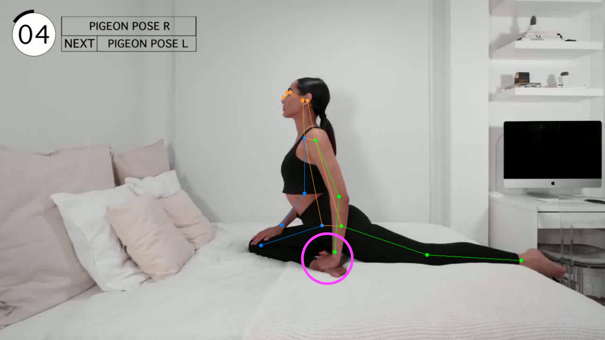

# Inferring human keypoints in videos by ViTPose and Extrapolating occluded keypoints (if there is any)

Transformers has been so successful in computer vision recently. Here I am trying to use ViTPose, a transformer-based model, to predict the 17 keypoints of human pose in videos. But sometimes there are missing keypoints in the raw ViTPose prediction due to occlusion (some body parts being blocked), like the right ankle is hidden by the hand in the following picture and it cannot be recognized.

For these kinds of occluded keypoints, I use a simple algorithm to extrapolate their locations by a polynomial fit of the trajectory of that keypoint in the previous few frames. To improve the jittering problem and enhance the overall smoothness in the raw ViTPose predictions, a low pass filter is employed for the video. We can see the improvement from the polyfit extrapolation and low pass filter (LPF) as follows:

Descriptions of different files:
---

vitpose_infer.py: codes for keypoints inference using ViTPose

extrapolation.py: codes for extrapolating occluded keypoints

main.py: codes for doing ViTPose inference and extrapolate any occluded keypoints
and outputting the resulting videos